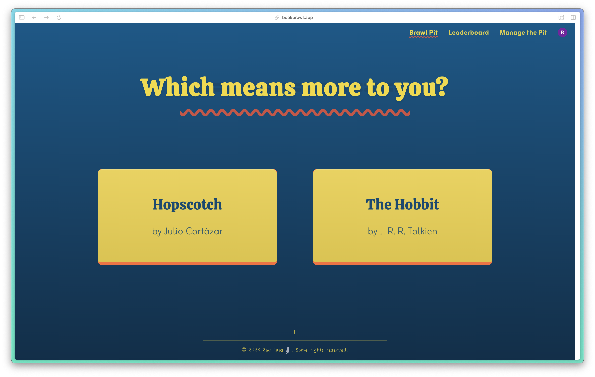
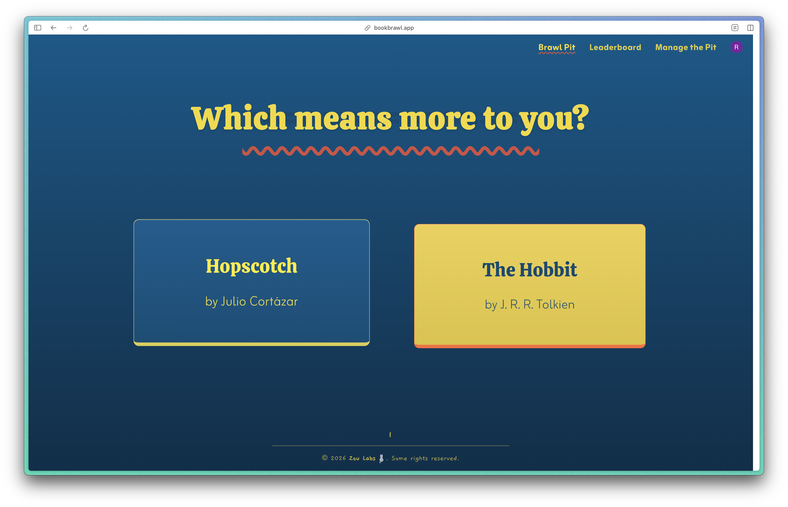
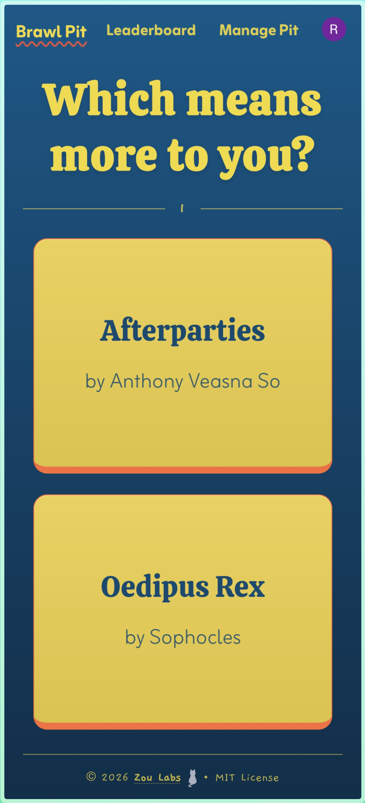
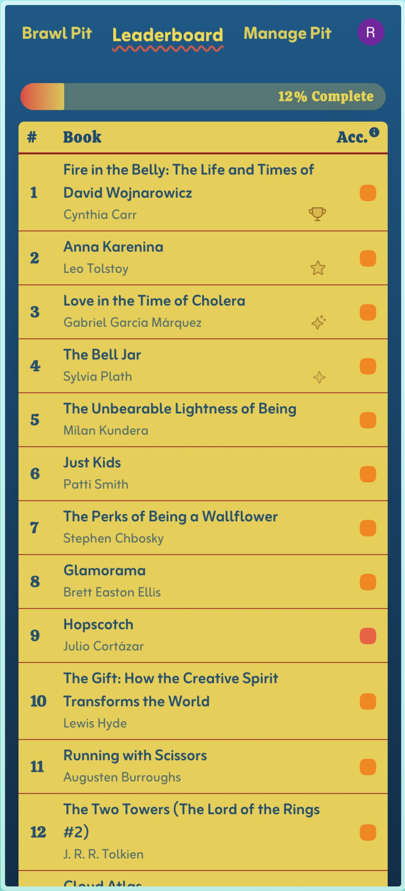
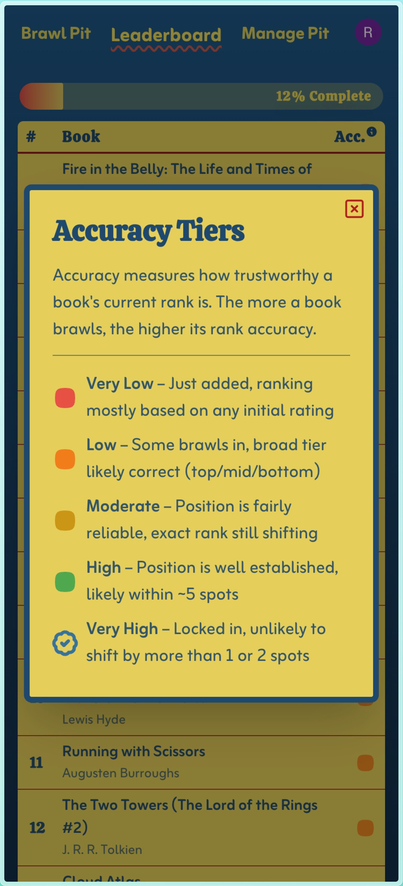
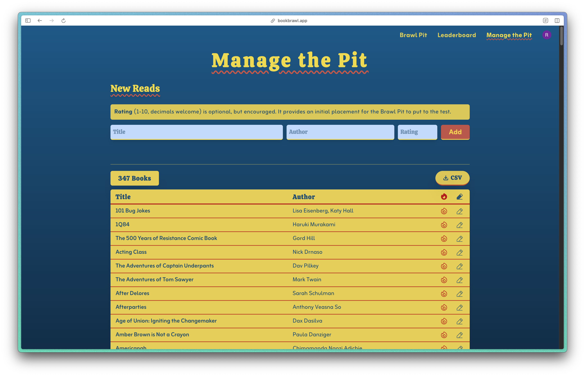
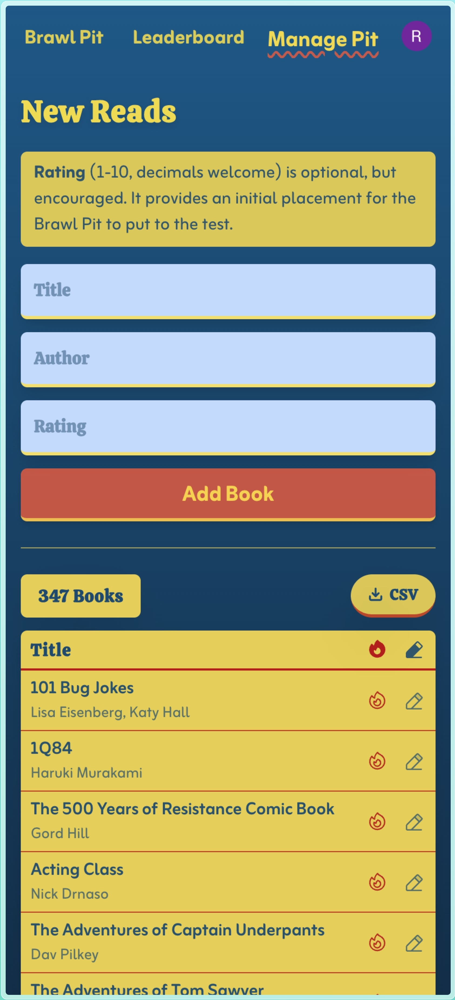
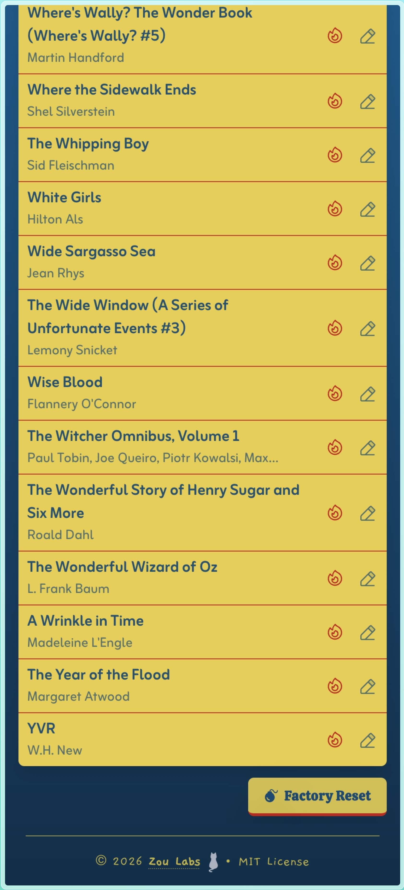
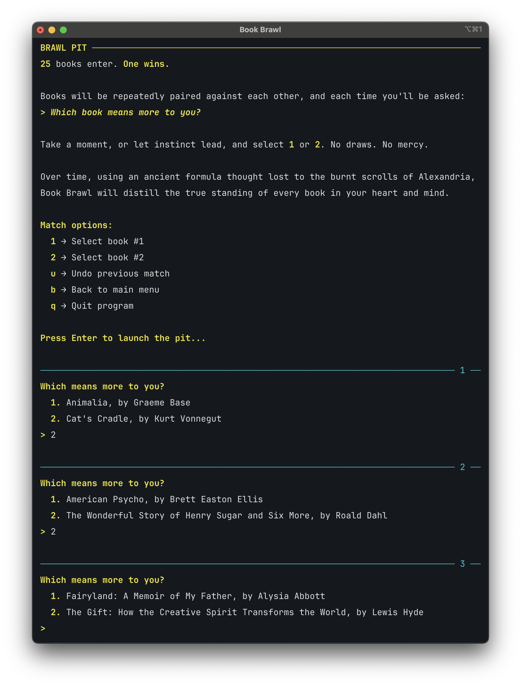
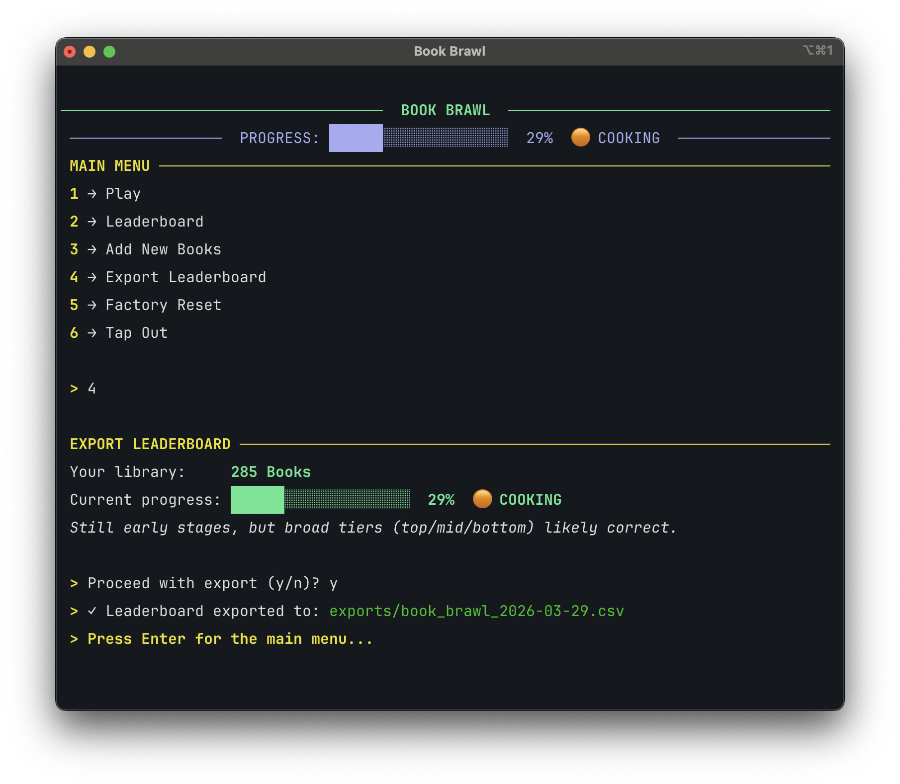

# 📚 Book Brawl


You've read dozens _(hundreds?!)_ of books and vaguely know you like some better than
others. But which one was actually your favourite? Your top 20? Top 42? And was that
rating of 7 you gave in 2021 really fair compared to the 8 you handed out last week?

Book Brawl cuts through the noise by turning your reading log into a tournament. It pits
two books head-to-head and asks one simple question:

> Which book means more to you, A or B?

Over time, an Elo-based rating system does the math and builds a ranked list that
reflects your ultimate breakdown. No more stuttering when someone asks you what your 33rd
favorite book of all time is. Those days are over!

> _**😈 TL;DR:** Book Brawl is a ranking system that becomes more reliable over time,
without ever fully freezing into rigidity. Giving book lovers and ranking enthusiasts a
fun **and** mathematically robust way to reflect on their books._

## 🪩 Live App: **[bookbrawl.app](https://bookbrawl.app)**

## 🪄 Preview

<details>
<summary>&nbsp;<b>Book Pit (main game loop)</b></summary>

<h4>Desktop:</h4>


<h4>Mobile:</h4>
<p align="center">

&nbsp;&nbsp;&nbsp;&nbsp;&nbsp;&nbsp;&nbsp;&nbsp;&nbsp;&nbsp;&nbsp;&nbsp;

</p>

</details>
<details>
<summary>&nbsp;<b>Leaderboard</b></summary>

<h4>Desktop:</h4>

<h4>Mobile:</h4>
<p align="center">

&nbsp;&nbsp;&nbsp;&nbsp;&nbsp;&nbsp;&nbsp;&nbsp;&nbsp;&nbsp;&nbsp;&nbsp;

</p>

</details>
<details>
<summary>&nbsp;<b>Manage the Pit</b></summary>

<h4>Desktop:</h4>

<h4>Mobile:</h4>
<p align="center">

&nbsp;&nbsp;&nbsp;&nbsp;&nbsp;&nbsp;&nbsp;&nbsp;&nbsp;&nbsp;&nbsp;&nbsp;

</p>

</details>
<details>
<summary> <b>&nbsp;Legacy CLI (where it all started)</b></summary>

<h4>First Run:</h4>

<h4>Main Menu:</h4>

<h4>Brawl Pit (main game loop):</h4>

<h4>Leaderboard:</h4>

<h4>Export Rankings:</h4>


</details>

## ⭐️ Features

- **Brawl Pit:** head-to-head book comparisons on loop
- **Elo-based ranking** system with accuracy tiers and **adaptive K-values**
- **Smart matchmaking:** prioritizes low-accuracy book, similar Elo scores, and rare
  pairings
- **Multifactor accuracy scoring:** tracks individual and overall rank accuracy and
  stability
- **Manage the Pit:** import books via CSV, add/edit/delete books manually, or factory
  reset your collection
- **Per-user data isolation:** full multi-user support via Clerk authentication (JWT
  verification with PyJWT and JWKS)
- **Persistent rankings** via PostgreSQL, supporting up to 2000 books per user
- **Tied rankings** broken by head-to-head wins, then by any initial rating

_See the [How it Works](https://github.com/rafacmaia/book-brawl#-how-it-works-deep-dive)
and [Architecture](https://github.com/rafacmaia/book-brawl#%EF%B8%8F-architecture)
sections below
for more details._

## ⚙️ Setup

> **Prerequisites:** Python 3.10+, Node.js 18+

> **Database Setup:** The app connects to a PostgreSQL database. To run it locally, you
> can spin up a free instance on Railway or Supabase, or use a local PostgreSQL
> installation, and add your connection string to .env as described below.

> **Auth Setup:** Auth is handled via [Clerk](https://clerk.com). To run the app locally,
> you'll need to create a free Clerk application and add your API keys to `.env` and
`frontend/.env.local` as described below.

> **Legacy CLI:** The original terminal app is still available, archived in [
`cli/`](cli/). It's SQLite-based, self-contained, no database setup required. Just follow
> step one below using `cli/requirements.txt` instead and then launch it,
`python main.py`.

#### 1. Clone the repo and set up the Python environment

```bash
git clone https://github.com/rafacmaia/book-brawl.git
cd book-brawl
python -m venv .venv
source .venv/bin/activate
pip install -r requirements.txt
```

#### 2. Set up Clerk auth and configure the backend

Create a `.env` file at the root with your _Clerk credentials_ and your _PostgreSQL
connection string_:

```env
CLERK_JWKS_URL=your_clerk_jwks_url_here
CLERK_SECRET_KEY=your_clerk_jwt_secret_key_here
DATABASE_URL=your_postgres_connection_string_here
```

Then launch the API server:

```bash
uvicorn api:app --reload
```

#### 3. Set up and launch the frontend server

Inside `frontend/`, create a `.env.local` file with your _Clerk publishable key_:

```env
VITE_CLERK_PUBLISHABLE_KEY=your_clerk_publishable_key_here
```

In a separate terminal than the one running the API server, install frontend
dependencies and launch the dev server:

```bash
cd frontend
npm install
npm run dev
```

#### 4. (Optional) Have Fun with It

## 📃 CSV Format

Book Brawl accepts CSV files with the following columns:

> title, author, rating

Where `rating` is a number from 1 to 10, inclusive. Decimals encouraged! It's used to
give new books a smarter starting Elo rather than a flat default.

Example:

```csv
title,author,rating
Love in the Time of Cholera,Gabriel García Márquez,9
The Lost World,Arthur Conan Doyle,6.5
American Psycho,Brett Easton Ellis,7.5
```

**To get you started, note that a sample CSV with 25 books is included at [
`sample-data/sample.csv`](sample-data/sample.csv).**

## 🏗️ Architecture

> **Stack:** FastAPI · PostgreSQL · React 19 · TypeScript · Tailwind CSS · Clerk  
> **Deployed on:** Railway (API + PostgreSQL) · Vercel (frontend)

Book Brawl uses a classic layered architecture:

```
Frontend (React/Vite)  →  API (FastAPI)  →  Services  →  Repository  →  PostgreSQL
```

Each layer has a single responsibility and only communicates with the layer directly
below it. The services layer contains all business logic and is framework-agnostic, being
built with both a web app and a CLI in mind.

## 🗂️ Project Structure

### Backend

| File/Directory                                               | Layer       | Description                             |
|--------------------------------------------------------------|-------------|-----------------------------------------|
| [`api.py`](api.py)                                           | API         | FastAPI endpoints                       |
| [`auth.py`](auth.py)                                         | API         | Clerk JWT verification                  |
| [`config.py`](config.py)                                     | Config      | Environment variables and app constants |
| [`models.py`](models.py)                                     | Domain      | Book data class                         |
| [`services/game_service.py`](services/game_service.py)       | Service     | Matchmaking and match resolution        |
| [`services/scoring_service.py`](services/scoring_service.py) | Service     | Elo calculation and accuracy scoring    |
| [`services/ranking_service.py`](services/ranking_service.py) | Service     | Book ranking and tiebreaking            |
| [`services/library_service.py`](services/library_service.py) | Service     | Book import and initial Elo mapping     |
| [`db/schema.sql`](db/schema.sql)                             | Persistence | Database schema (source of truth)       |
| [`db/books_repo.py`](db/books_repo.py)                       | Persistence | Book queries                            |
| [`db/comparisons_repo.py`](db/comparisons_repo.py)           | Persistence | Comparison queries                      |
| [`db/readers_repo.py`](db/readers_repo.py)                   | Persistence | User (reader) queries                   |
| [`db/connection.py`](db/connection.py)                       | Persistence | Database connection and schema init     |

### Frontend _(in `frontend/`)_

| File                                                              | Description                                       |
|-------------------------------------------------------------------|---------------------------------------------------|
| [`src/App.tsx`](frontend/src/App.tsx)                             | Root component with routing and auth              |
| [`src/pages/BrawlPit.tsx`](frontend/src/pages/BrawlPit.tsx)       | Main game loop; head-to-head matches              |
| [`src/pages/Leaderboard.tsx`](frontend/src/pages/Leaderboard.tsx) | Rankings and progress page                        |
| [`src/pages/ManagePit.tsx`](frontend/src/pages/ManagePit.tsx)     | Collection management page: add/edit/delete books |
| [`src/components/Header.tsx`](frontend/src/components/Header.tsx) | Shared header and nav                             |
| [`src/components/Footer.tsx`](frontend/src/components/Footer.tsx) | Shared footer                                     |
| [`src/api.ts`](frontend/src/api.ts)                               | Authenticated API fetch helper                    |

### CLI _(legacy, in `cli/`)_

The original terminal app is still functional and fully self-contained in `cli/`, but is
no longer getting new features. It's being formally retired in a future update, with the
web app having taken center stage.

## 🗺️ Roadmap

- [X] Edit/delete books via the web UI
- [ ] Book import from Goodreads, Fable, and maybe others
- [ ] Onboarding/instructions page for new users
- [ ] Filter rankings by genre, author, or year read (e.g., "2021" or "Fantasy")
- [ ] CLI retirement and archival

## 📬 Contact

Built by [Rafa Maia](https://github.com/rafacmaia) at **Zou Labs 🐈‍⬛**.

Feedback, questions, cat photos, and book recommendations welcome any
time – [zoulabs.dev@gmail.com](mailto:zoulabs.dev@gmail.com)

---

## 🧠 How It Works: Deep Dive

Each book starts with an Elo score derived from the user's initial rating (1–10 scale,
mapped to an initial 800–1200 Elo range). From there, rankings are determined entirely
through head-to-head comparisons.

Every time a book wins a matchup, both books’ Elo scores are updated using the standard
Elo formula. However, the app extends basic Elo with adaptive volatility and stability
modeling to improve convergence speed and ranking reliability.

#### Adaptive K-Factor

The Elo K-value adapts dynamically based on each book's accuracy score:

- New books start with K=40, allowing fast movement toward their correct tier
- As confidence grows, K steps down through 32 → 24 → 16
- High-accuracy books remain correctable but won't swing wildly from a single match

This ensures fast early convergence without sacrificing long-term ranking stability.

### 🔍 Accuracy Scoring

A book’s accuracy score captures the stability of its current rank. It's
calculated as a weighted combination of three signals:

1. **Absolute Coverage** – How many unique opponents the book has faced. This drives its
   general placement within the rankings (top/mid/bottom).
2. **Local Coverage** – How thoroughly the book has been tested against competitively
   similar opponents (based on expected win probability). This refines placement within
   its tier.
3. **Local Density (Rank Fragility)** – Measures how many books sit within a narrow Elo
   band. Even if a book has strong coverage, tight clusters imply potential rank
   instability, so this measure prevents premature “Very High” accuracy assignments.

#### Accuracy Tiers

| Tier        | Meaning                                              |
|-------------|------------------------------------------------------|
| 🔴 Very Low | Early data, ranking based mostly on initial rating   |
| 🟠 Low      | Broad tier (top/mid/bottom) likely correct           |
| 🟡 Moderate | General position reliable, exact rank still shifting |
| 🟢 High     | Position well established, likely within ~5 spots    |
| ✅ Very High | Locked in, unlikely to shift significantly           |

### 🎯 Intelligent Matchmaking

Matchups are not random.

The Brawl Pit uses weighted stochastic matchmaking that prioritizes:

- Books with very few matches (to get some baseline data on every book)
- Rare or unmatched pairings
- Books with similar Elo score (most informative matchups)
- Books with lower accuracy scores (to progress overall ranking accuracy)

This maximizes information gain per match and speeds up convergence without requiring
full pairwise comparisons

## 📄 License

[MIT License](https://github.com/rafacmaia/book-brawl/blob/main/LICENSE)
