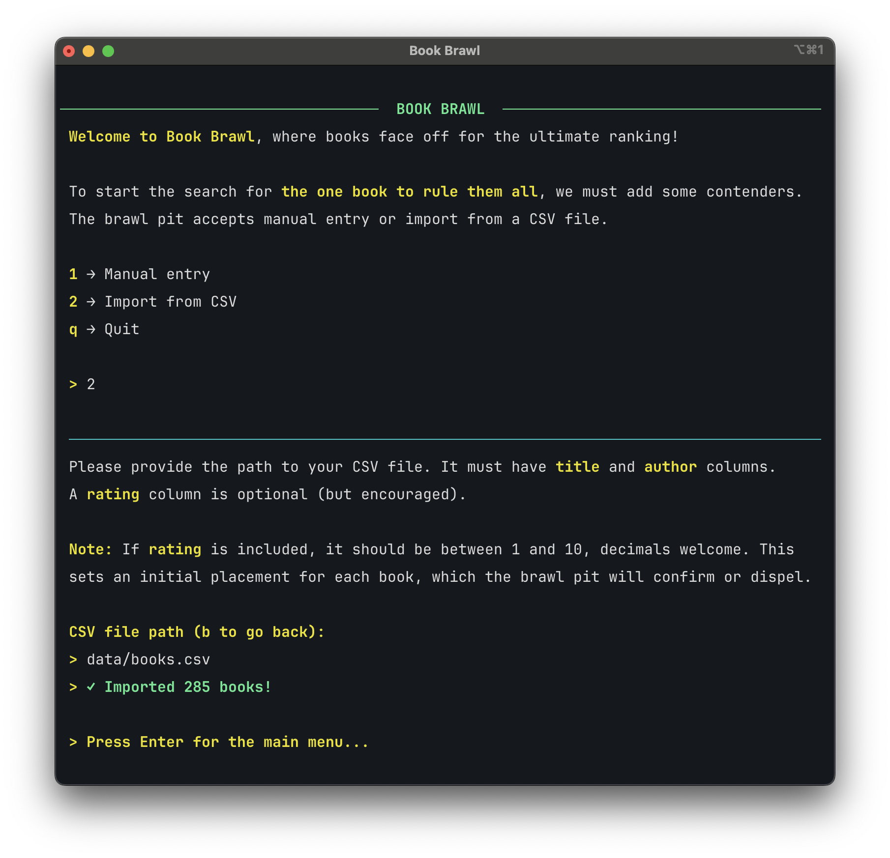
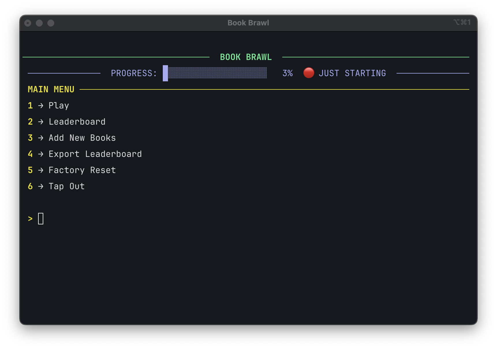
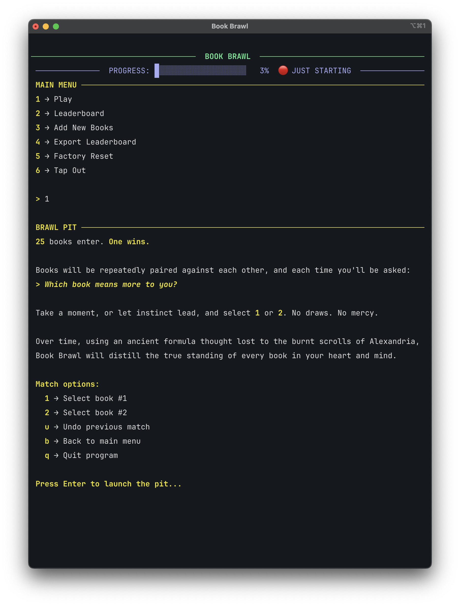
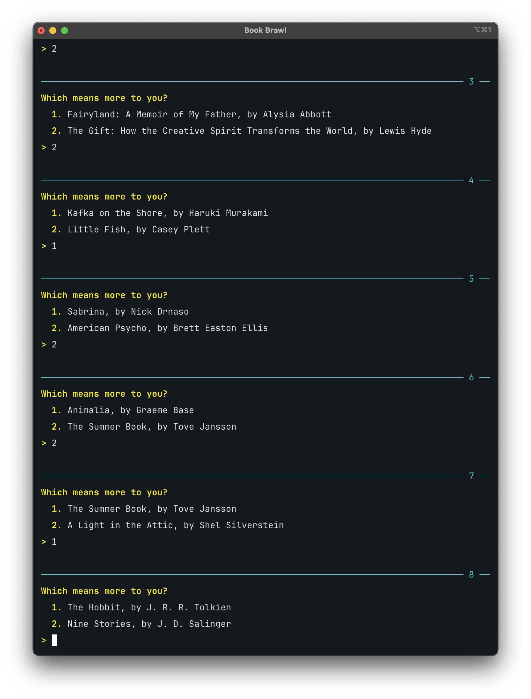
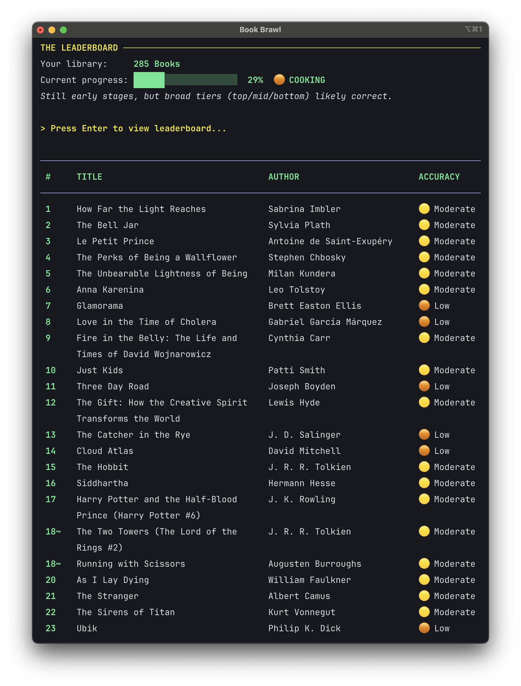
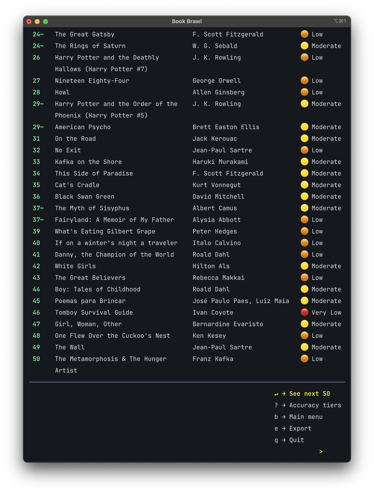
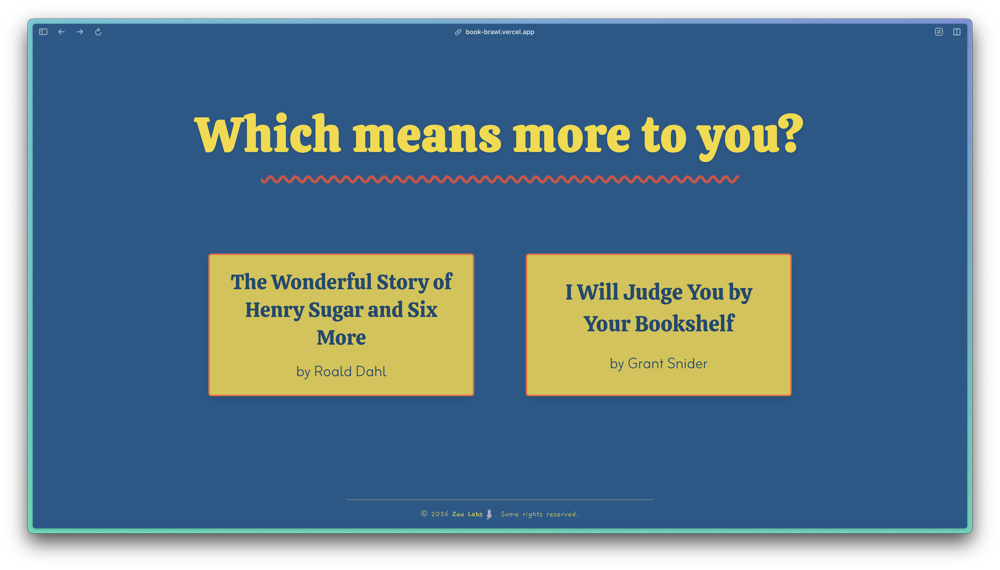
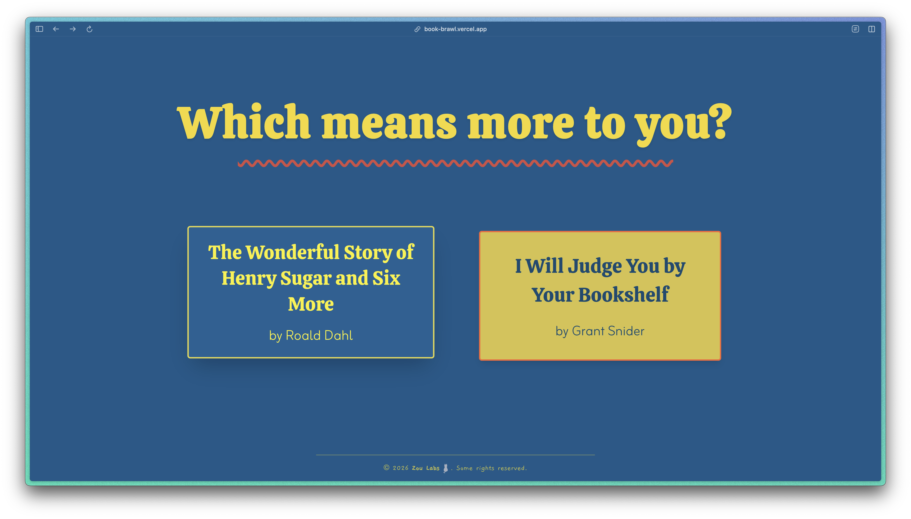
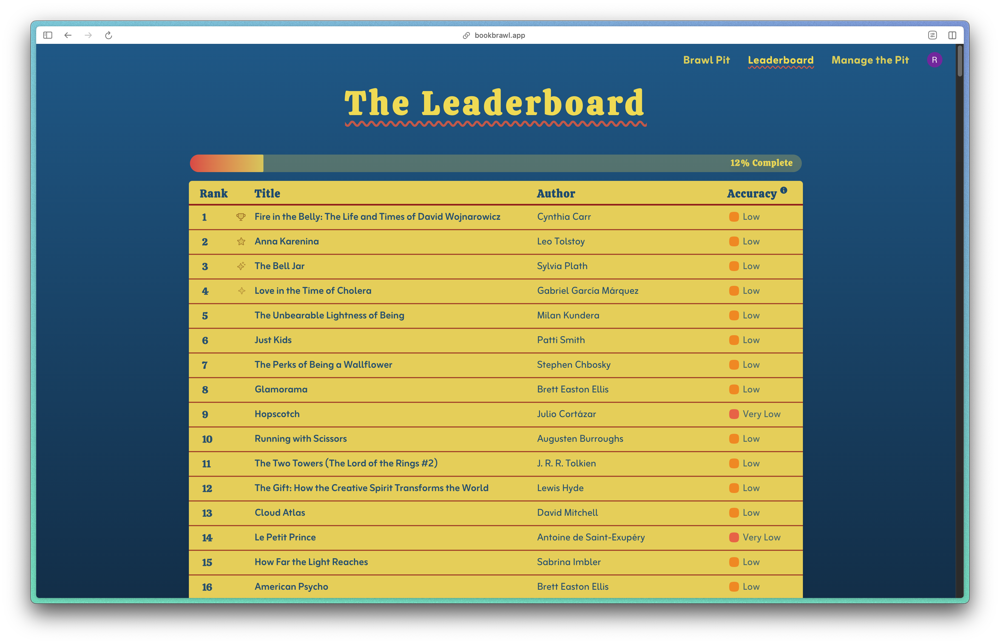

# 📚 Book Brawl


You've read dozens _(hundreds?!)_ of books and vaguely know you like some better than
others. But which one was actually your favourite? Your top 20? Top 42? And was that
rating of 7 you gave in 2021 really fair compared to the 8 you handed out last week?

Book Brawl cuts through the noise by turning your reading log into a tournament. It pits
two books head-to-head and asks one simple question:

> Which book means more to you, A or B?

Over time, an Elo-based rating system does the math and builds a ranked list that
reflects your ultimate breakdown. No more stuttering when someone asks you what your 33rd
favorite book of all time is. Those days are over!

> _**😈 TL;DR:** Book Brawl is a ranking system that becomes more reliable over time,
without ever fully freezing into rigidity. Giving book lovers and ranking enthusiasts a
fun **and** mathematically robust way to reflect on their books._

## 🪩 Live Demo (in development) > **[book-brawl.app](https://book-brawl.vercel.app)**

## 🪄 Preview

<details>
<summary><b>&nbsp;CLI Screenshots</b></summary>

<h3>First Run:</h3>


<h3>Main Menu:</h3>


<h3>Brawl Pit (main game loop):</h3>




<h3>View Leaderboard:</h3>



<h3>Export Rankings:</h3>


</details>

<details>
<summary><b>&nbsp;Web Screenshots</b></summary>

<h3>Book Pit (main game loop):</h3>



<h3>View Leaderboard:</h3>

</details>

## ⭐️ Features

- Brawl Pit: head-to-head book comparisons on loop
- Elo-based ranking system with accuracy tiers and variable K values
- Smart matchmaking: prioritize low-accuracy book, similar Elo scores, and rare pairings
- Multifactor accuracy scoring: tracks individual and overall rank accuracy and stability
- CSV import or manual entry, using initial user ratings to intelligently map
  new entries onto the Elo-based rankings _(CLI only)_
- Undo option: redo the previous match at any point in the Brawl Pit _(CLI only)_
- Persistent rankings via SQLite, allowing up to 2000 books per user
- Tied rankings broken by head-to-head wins, then by initial rating
- Leaderboard export to CSV _(CLI only)_
- Authentication via Clerk (JWT verification with PyJWT and JWKS) _(Web only)_

_See the [How it Works](#-how-it-works) and [Architecture](#-architecture) sections below
for more details._

## ⚙️ Setup

### 🖼️ Web App (Frontend + API)

> **Prerequisites:** Python 3.10+, Node.js 18+

> Auth is handled via [Clerk](https://clerk.com). To run the web app locally, you'll need
> to create a free Clerk application and add your API keys to `.env` and
`frontend/.env.local` as described below.

1. **Clone Repo and Set Up Python Environment**

    - Clone the repo:
       ```bash
       git clone https://github.com/rafacmaia/book-brawl.git
       cd book-brawl
       ```
    - Set up the Python virtual environment, activate it, and install dependencies (
      listed
      in [`requirements.txt`](requirements.txt): FastAPI, SQLite, Rich, PyJWT, and more):
       ```bash
       python -m venv .venv
       source .venv/bin/activate
       pip install -r requirements.txt
       ```

2. **Set Up Clerk Auth and Launch the Backend API**

    - Create a `.env` file at root level and add the following from your Clerk
      application:
        ```env
        CLERK_JWKS_URL=your_clerk_jwks_url_here
        CLERK_SECRET_KEY=your_clerk_jwt_secret_key_here
        ```
    - Launch the API:
      ```bash
      uvicorn api:app --reload
      ```

3. **Set Up the Frontend**

    - In a separate terminal, set up the frontend and its dependencies:
        ```
        cd frontend
        npm install
        ```
    - Inside `frontend/`, create a `.env.local` file with your Clerk publishable key:
        ```env
        VITE_CLERK_PUBLISHABLE_KEY=your_clerk_publishable_key_here
        ```
    - Launch the frontend dev server:
        ```bash
        npm run dev
        ```

4. **(Optional) Have Fun with It**

### 💾 CLI (Terminal App)

1. **Clone Repo and Set Up Python Environment as with the Web App above**


2. **Launch the app**

   ```bash
   python main.py
   ```

   #### Observations

    - A sample CSV with 25 books is included at [`data/sample.csv`](data/sample.csv) to
      get
      you started.

    - CLI Optional Launch Flags:
      ```bash
       python main.py --test  # Uses a separate test database
       python main.py --beta  # Uses the beta database (simply an extra copy of the main db)
      ```

## 📃 CSV Format

Your CSV file should have the following columns:

> title, author, rating

Where rating is a number from 1 to 10, inclusive. Decimals encouraged!

Example:

```csv
title,author,rating
Love in the Time of Cholera,Gabriel García Márquez,9
The Lost World,Arthur Conan Doyle,6.5
Beezus and Ramona,Beverly Cleary,7 
American Psycho,Brett Easton Ellis,7.5
```

## 🏗️ Architecture

Book Brawl is built in a classic layered architecture with a Python CLI, a React web
frontend, FastAPI backend, and SQLite database:

```
Frontend (React/Vite)  →  API (FastAPI)  →  Services  →  Repository  →  SQLite
```

Each layer has a single responsibility and only communicates with the layer directly
below it. The services layer contains all business logic and is framework-agnostic,
usable by both the web API and the original CLI.

## 🗂️ Project Structure

### **Backend**

| File/Directory                                               | Layer       | Description                             |
|--------------------------------------------------------------|-------------|-----------------------------------------|
| [`api.py`](api.py)                                           | API         | FastAPI endpoints                       |
| [`auth.py`](auth.py)                                         | API         | Clerk JWT verification                  |
| [`config.py`](config.py)                                     | Config      | Environment variables and app constants |
| [`models.py`](models.py)                                     | Domain      | Book data class                         |
| [`state.py`](state.py)                                       | State       | In-memory session state                 |
| [`services/game_service.py`](services/game_service.py)       | Service     | Matchmaking and match resolution        |
| [`services/scoring_service.py`](services/scoring_service.py) | Service     | Elo calculation and accuracy scoring    |
| [`services/ranking_service.py`](services/ranking_service.py) | Service     | Book ranking and tiebreaking            |
| [`services/library_service.py`](services/library_service.py) | Service     | Book import and initial Elo mapping     |
| [`db/books_repo.py`](db/books_repo.py)                       | Persistence | Book queries                            |
| [`db/comparisons_repo.py`](db/comparisons_repo.py)           | Persistence | Comparison queries                      |
| [`db/users_repo.py`](db/users_repo.py)                       | Persistence | User queries                            |
| [`db/connection.py`](db/connection.py)                       | Persistence | Database connection and schema          |

### **CLI**

| File                                             | Description                                    |
|--------------------------------------------------|------------------------------------------------|
| [`main.py`](main.py)                             | Entry point and main menu                      |
| [`game.py`](game.py)                             | Game loop and match flow                       |
| [`leaderboard.py`](leaderboard.py)               | Rankings display and table rendering           |
| [`library_management.py`](library_management.py) | Book entry and library reset                   |
| [`csv_handler.py`](csv_handler.py)               | CSV import and export                          |
| [`ui.py`](ui.py)                                 | UI strings, styling utilities, and color theme |
| [`utils.py`](utils.py)                           | Formatting and input helpers                   |

### **Frontend** _(React + Vite, in `frontend/`)_

| File                                                              | Description                          |
|-------------------------------------------------------------------|--------------------------------------|
| [`src/App.tsx`](frontend/src/App.tsx)                             | Root component with routing and auth |
| [`src/pages/BrawlPit.tsx`](frontend/src/pages/BrawlPit.tsx)       | Head-to-head match page              |
| [`src/pages/Leaderboard.tsx`](frontend/src/pages/Leaderboard.tsx) | Rankings page                        |
| [`src/components/Footer.tsx`](frontend/src/components/Footer.tsx) | Shared footer                        |
| [`src/api.ts`](frontend/src/api.ts)                               | Authenticated API fetch helper       |

## 🧠 How It Works

Each book starts with an Elo score derived from the user's initial rating (1–10 scale,
mapped to an initial 800–1200 range). From there, rankings are determined entirely
through head-to-head comparisons.

Every time a book wins a matchup, both books’ Elo scores are updated using the standard
Elo formula. However, the app extends basic Elo with adaptive volatility and stability
modeling to improve convergence speed and ranking reliability.

#### Adaptive K-Factor

The Elo K-value adapts dynamically based on each book's accuracy score:

- New books start with K=40, allowing fast movement toward their correct tier
- As confidence grows, K steps down through 32 → 24 → 16
- High-accuracy books remain correctable but won't swing wildly from a single match

This ensures fast early convergence without sacrificing long-term ranking stability.

### 🔍 Accuracy Scoring

A book’s accuracy score captures the stability of its current rank. It's
calculated as a weighted combination of three signals:

1. **Absolute Coverage** – How many unique opponents the book has faced. This drives its
   general placement within the rankings (top/mid/bottom).
2. **Local Coverage** – How thoroughly the book has been tested against competitively
   similar opponents (based on expected win probability). This refines placement within
   its tier.
3. **Local Density (Rank Fragility)** – Measures how many books sit within a narrow Elo
   band. Even if a book has strong coverage, tight clusters imply potential rank
   instability, so this measure prevents premature “Very High” accuracy assignments.

#### Accuracy Tiers

| Tier        | Meaning                                              |
|-------------|------------------------------------------------------|
| 🔴 Very Low | Early data, ranking based mostly on initial rating   |
| 🟠 Low      | Broad tier (top/mid/bottom) likely correct           |
| 🟡 Moderate | General position reliable, exact rank still shifting |
| 🟢 High     | Position well established, likely within ~5 spots    |
| ✅ Very High | Locked in, unlikely to shift significantly           |

### 🎯 Intelligent Matchmaking

Matchups are not random.

The Brawl Pit uses weighted stochastic matchmaking that prioritizes:

- Books with very few matches (to get some baseline data on every book)
- Rare or unmatched pairings
- Books with similar Elo score (most informative matchups)
- Books with lower accuracy scores (to progress overall ranking accuracy)

This maximizes information gain per match and speeds up convergence without requiring
full pairwise comparisons

## 🗺️ Roadmap

- [ ] Per-user data isolation (multi-user support!)
- [ ] Book intake via the web API
- [ ] PostgreSQL migration (Railway)
- [ ] Support for removing individual books
- [ ] Filter rankings by genre, author, or year read (e.g., "2021" or "Fantasy")

## 📬 Contact

Built by [Rafa Maia](https://github.com/rafacmaia) at **Zou Labs 🐈‍⬛**.

Feedback, questions, cat photos, and book recommendations welcome any
time – [zoulabs.dev@gmail.com](mailto:zoulabs.dev@gmail.com)
